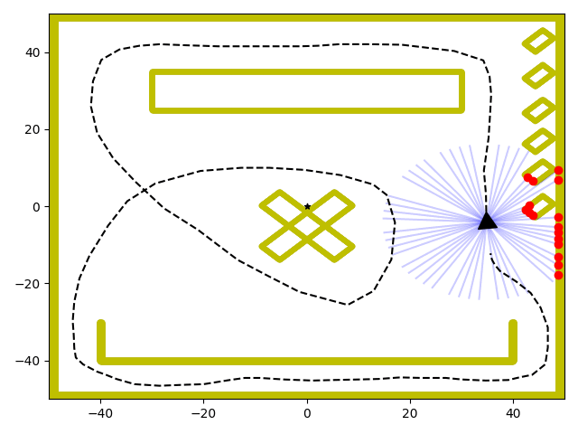

## VSA-OGM - Occupancy Grid Mapping in 2D

In this application of bio-inspired vector symbolic architectures, we employ a novel hyperdimensional occupancy grid mapping system with Shannon entropy. For the most in-depth exploration of our experiments and results, please take a look at [our paper](https://arxiv.org/pdf/2408.09066).

*This work was supported under grant 5.21 from the University of Michigan's Automotive Research Center (ARC) and the U.S. Army's Ground Vehicle Systems Center (GVSC).* 

 

---

###

The VSA-OGM is wrapped together as a single pip package. You must pre-install pytorch depending on your specific machine and the semantic pointer library (spl). SPL is included in this repo as a second directory. You can locally install the library with the following command:

```bash
python -m pip install .
```

It has currently been tested on MacOS and Ubuntu with CPU and CUDA 12.2. Other operating systems and CUDA versions should be supported but it has not been formally tested.

---

### Datasets

- Toy Sim (Single Agent): included in `datasets`
- Toy Sim (Fusion): download [Agent 1](https://gmuedu-my.sharepoint.com/:u:/g/personal/ssnyde9_gmu_edu/EVNScsJma1lMpQmTgLmBmBoBaVgLRgwrIcVRiWLAOtHiqA?e=GrE7eq) and [Agent 2](https://gmuedu-my.sharepoint.com/:u:/g/personal/ssnyde9_gmu_edu/ETE2c01yROlIkH3-gLSo7vsBIKKOt1S_fgdVfthFgEgW3Q?e=aEAXiM)
- Intel (Single Agent): included in `datasets`
- Intel (Fusion): generate with [this notebook](./notebooks/datasets/intel_map_fusion_data.ipynb)
- EviLOG: download according to [their repository](https://github.com/ika-rwth-aachen/EviLOG)

---

### Authors and Contact Information

- **Shay Snyder****: [ssnyde9@gmu.edu](ssnyde9@gmu.edu)
- **Andrew Capodieci**: [acapodieci@neyarobotics.com](acapodieci@neyarobotics.com)
- **David Gorsich**: [david.j.gorsich.civ@army.mil](david.j.gorsich.civ@army.mil)
- **Maryam Parsa**: [mparsa@gmu.edu](mparsa@gmu.edu)

If you have any issues, questions, comments, or concerns about VSA-OGM, please reach out to the corresponding author (**). We will respond as soon as possible.

---

### Reference and Citation

If you find our work useful in your research endeavors, we would appreciate if you would consider citing [our paper](https://arxiv.org/pdf/2408.09066):

```text
@misc{snyder2024braininspiredprobabilisticoccupancy,
      title={Brain Inspired Probabilistic Occupancy Grid Mapping with Hyperdimensional Computing}, 
      author={Shay Snyder and Andrew Capodieci and David Gorsich and Maryam Parsa},
      year={2024},
      eprint={2408.09066},
      archivePrefix={arXiv},
      primaryClass={cs.RO},
      url={https://arxiv.org/abs/2408.09066}, 
}
```

